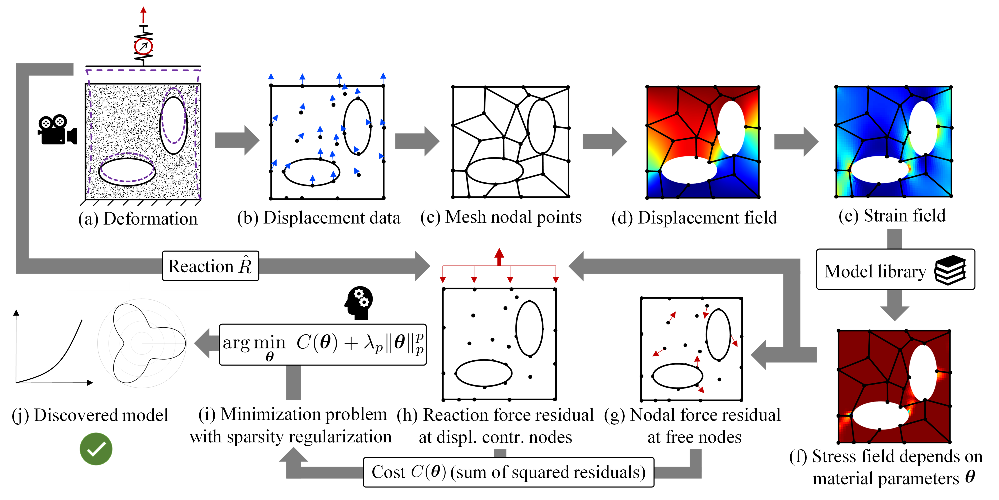

# Introduction
EUCLID (Efficient Unsupervised Constitutive Law Identification & Discovery) utilizes displacement and reaction force data, but no stress data as these are not available from experiments, to discover material laws as compact and interpretable mathematical formulas. A large catalog of candidate material models is constructed out of which dominant candidates are selected through sparse regression. To compensate the unavailability of stress data, physics knowledge is employed by minimizing the sum of squared residuals of the weak linear momentum balance.

Full-field displacement and net reaction force data that are obtained from a single experiment (a) serve as input data for EUCLID. The displacement data (b) is interpolated (c) to obtain the displacement field (d) and after differentiation the strain field (e). A general material model library is constructed, which can describe a variety of different material responses dependent on the choice of material parameters `theta`. Based on the model library, the stresses (f) and hence the residuals of the weak linear momentum balance (g,h) can be expressed dependent on the unknown parameters `theta`. The linear momentum balance serves as a physical constraint on the material parameter space. Minimizing the  sum of squared residuals together with a sparsity promoting regularization term (i) yields a sparse parameter vector `theta` and hence an interpretable constitutive law expressed by a compact mathematical formula (j).

# About the documentation
The documentation contains detailed information for the most important functions (subroutines).
For each function, the _input arguments_ and _output arguments_ are provided.
The documentation can be browsed by using the search box.
The provided _examples_ help to understand the workflow of EUCLID.

# References

1.	Moritz Flaschel&#42;, Siddhant Kumar&#42; and Laura De Lorenzis (&#42;contributed equally)  
	__Unsupervised discovery of interpretable hyperelastic constitutive laws__  
	_Computer Methods in Applied Mechanics and Engineering, 381, p.113852_ ([open access](https://www.sciencedirect.com/science/article/pii/S0045782521001894))
