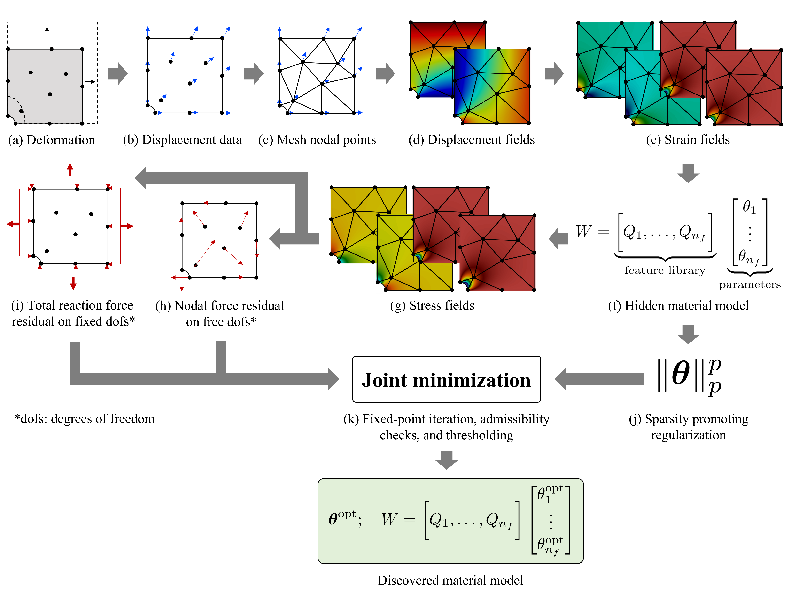

EUCLID (Efficient Unsupervised Constitutive Law Identification & Discovery) is here applied to discover strain energy density functions of hyperelastic materials.

Starting from a deformed body under loading (a), the point-wise displacement measurements (b) are interpolated by constructing a finite element mesh (c).
The resulting continuous displacement field (d) is differentiated to obtain the strain field (e).
The material strain energy density is formulated as a linear combination of a large catalogue of nonlinear features and unknown material parameters `theta` (f).
The derivative of the strain energy density with respect to the strain field yields the stress field (g).
A joint optimization problem (k) is formulated to find the unknown material parameters `theta` such that the weak form of the linear momentum balance in the bulk material (h)
and the reaction force balance on the Dirichlet boundaries (i) are satisfied.
The joint optimization problem (k) also includes a sparsity-promoting regularization (j) to yield a parsimonious and interpretable material model.

# About the documentation
The <a href="https://EUCLID-code.github.io/EUCLID-hyperelasticity/mkdocs/site" target="_blank">documentation</a> contains detailed information for the most important functions (subroutines).
For each function, the _input arguments_ and _output arguments_ are provided.
The documentation can be browsed by using the search box.
The provided _example_ helps to understand the workflow of EUCLID, it can be executed using the code and data provided on <a href="https://github.com/EUCLID-code/EUCLID-hyperelasticity" target="_blank">GitHub</a>.
The data used in the [publication](https://EUCLID-code.github.io/EUCLID-hyperelasticity/mkdocs/site/publication/) can be downloaded from the <a href="https://www.research-collection.ethz.ch/handle/20.500.11850/505693" target="_blank">ETH Research Collection</a>.

